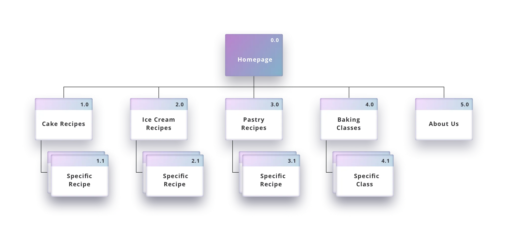

# Server-Side Website

## Templating met JSON data

Over het fetchen van data en dit gebruiken in Liquid om HTML te renderen.

### Aanpak
Nu je een briefing hebt gekregen van de opdrachtgever weet je (ongeveer) wat de bedoeling is. Voor elk project is een database in Directus waarmee je de website gaat maken.

Als je een server-side website gaat ontwerpen en bouwen met JSON data, zal je in de ontwerpfase moeten onderzoeken welke data beschikbaar is en hoe je met de data uit de database in Liquid HTML kan renderen.

Dit doe je door een UML diagram te schetsen. Een UML diagram is uitgebreide breakdown schets van de pagina's die je wil maken, met de urls, routes, en dynamische data.

<!--
kan je beginnen met prototyping; schets je ideeën, een Sitemap, Wireflow en een HiFi ontwerp in Figma. Probeer ook de data uit Directus te fetchen.
Maak als eerste het ontwerp in HTML voordat je met CSS begint.
-->

## UML Diagram

Een UML diagram is een manier om systemen en software te visualiseren met behulp van Unified Modeling Language (UML). Developers maken UML-diagrammen om inzicht te krijgen in de ontwerpen, codearchitectuur en implementatie van complexe softwaresystemen.

Voor deze opdracht schets je de pagina's die je gaat bouwen en bedenk je welke data je daarvoor moet fetchen, zodat het duidelijk is hoe de server-side code werkt. Bedenk zelf een gestructureerde manier van het tekenen van alle elementen, lijnen en annotaties.

### Sitemap met URL's
Eerst bepaal je welke pagina's je gaat maken en welke url's daarbij horen.

Teken een sitemap van de verschillende pagina's van de opdracht die je hebt gekregen (homepage, overzichtspagina, detailpagina, aanmeldpagina, contactpagina, etc...)
Geef de pagina's duidelijke nummers en laat goed zien op welk niveau de pagina's staan.

Schrijf per pagina de URL die je wil gebruiken voor de routes.

 *Voorbeeld van een sitemap met een duidelijke structuur en nummering.*

#### Bronnen
- [Workshop Prototyping - Sitemap tekenen](https://github.com/fdnd-task/the-client-website/blob/main/docs/prototyping.md#sitemap)


### Wireframes en dynamische data
Teken nu de Wireframes van de pagina's die je wil gaan ontwerpen en bouwen. Begin deze sprint met een overzicht- en detailpagina.

Maak een nette Hi-Fi schets, zodat het duidelijk is welke teksten en andere content op de pagina getoond moeten worden.
Schrijf onder de tekening de url van de pagina.

### Data analyseren
Geef in je tekening aan welke data statisch is en welke data uit de database moet komen.

Om te weten welke data uit de database komt zul je moeten onderzoeken hoe je de JSON data kan fetchen. Onderzoek met een browser welke data er beschikbaar is in de databse van jouw project.

In sommige gevallen staat er in de JSON data een verwijzing naar een andere tabel. In de WHOIS database van FDND stond bij de squad data bijvoorbeeld een verwijzing naar `persons`:

```json
{
  "data": {
    "id": 12,
    "sort": 11,
    "date_updated": null,
    "name": "1H",
    "cohort": "2425",
    "nickname": null,
    "description": null,
    "website": null,
    "tribe": 1,
    "persons": [
      65,
      66, 
      67, 
      ...
    ]
  }
}
//url: https://fdnd.directus.app/items/squad/12
```

Je kan in Directus deze 'gelinkte' data ook fetchen. Door de `fields` parameter mee te geven aan de url kan je bepalen welke data Directus teruggeeft. Door `?fields=*` mee te geven krijg je alle velden. Met een komma kan je meer velden laten zien, bijvoorbeeld door `?fields=*,persons.*` mee te geven krijg je data van de gelinkte personen. Probeer dit maar eens in een browser.

En zo kan je nog een niveau dieper: Als je `?fields=*,persons.person_id.*` meegeeft krijg je alle data van alle gelinkt personen.

Dat is misschien een beetje te veel data ... lukt het je om de namen te tonen van de gelinkte personen in de squad data?
<!-- fields=*,persons.person_id.name -->

Ga nu eens kijken naar de data in Directus van jouw opdracht. Zie je daar ook 'gelinkte' tabellen? Probeer eens of je de data kan tonen.
Als je snapt hoe je de data uit Directus kan halen, geef dan in je Wireframe aan welke data uit de database moet komen en schrijf onder je tekening de API url die je hiervoor nodig hebt.

#### Bronnen
- [Directus - Query Parameters](https://directus.io/docs/guides/connect/query-parameters)


### HTML pseudo code
Nu je weet welke data je nodig hebt voor de pagina's die je gaat bouwen kan je je Wireframe uitbreiden met een technische breakdown.

Voeg eerst aan je Wireframe annotaties toe met de HTML die je nodig hebt.

Probeer daarna te bedenken hoe je van de JSON data de HTML kan maken in Liquid. Heb je een `for` loop nodig? Of een `if .. else`? Annoteer dit in je Wireframe. Lees in de Liquid documentatie over de 'Tags' die je kan gebruiken, en probeer hiermee pseudo code te schrijven in je Wireframe.

#### Bronnen
- [Liquid - Tags](https://liquidjs.com/tags/overview.html)


## Routes, Requests en Renderen
Nu je ongeveer weet welke data er is en hoe dit op de pagina;s wil gebuiken kan je verder met bouwen. Maak routes en views aan die je nodig hebt, fetch de data en render de HTML!

Lees zo nodig de [workshop Filteren en sorteren van sprint 7](https://github.com/fdnd-task/connect-your-tribe-squad-page/blob/main/docs/filteren-en-sorteren.md). Daarin staat stap voor stap uitleg hoe je nu verder kan... 

